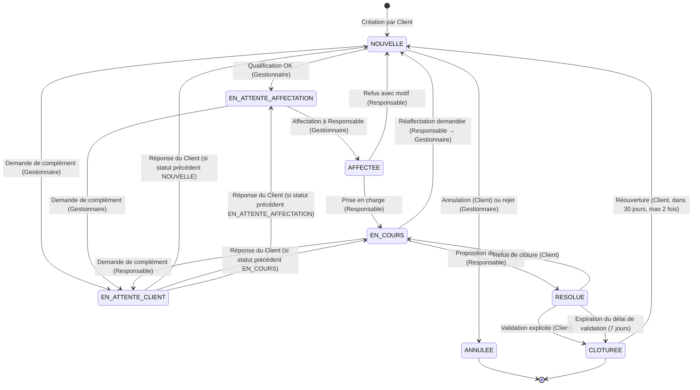

# 04 — Cycle de vie d'une demande

Ce chapitre formalise la machine à états d'une demande dans MyTDFRIK. Il définit les statuts, les transitions autorisées, leurs déclencheurs, leurs acteurs et les événements émis (notamment vers le module de notifications, chapitre 07).

## 4.1 Liste des statuts

| Code interne | Libellé public | Description |
|---|---|---|
| `NOUVELLE` | Nouvelle | Demande venant d'être soumise, en attente de qualification par un Gestionnaire. |
| `EN_ATTENTE_AFFECTATION` | En attente d'affectation | Demande qualifiée par le Gestionnaire, en attente d'affectation à un Responsable. |
| `AFFECTEE` | Affectée | Demande attribuée à un Responsable nominal, qui n'a pas encore démarré le traitement. |
| `EN_COURS` | En cours de traitement | Le Responsable a démarré le traitement. |
| `EN_ATTENTE_CLIENT` | En attente client | Un complément est attendu du Client ; le compteur de SLA est suspendu. |
| `RESOLUE` | Résolue | Le Responsable a livré la résolution et attend la validation du Client. |
| `CLOTUREE` | Clôturée | Demande clôturée (par validation explicite ou expiration du délai de validation). |
| `ANNULEE` | Annulée | Demande annulée par le Client avant qualification, ou par le Gestionnaire pour cause d'incohérence majeure. |

## 4.2 Diagramme d'états

## 4.3 Tableau récapitulatif des transitions

Chaque ligne décrit une transition autorisée. Toute transition non listée ici est **interdite** et doit être rejetée par l'API avec un code HTTP 409.

| ID | Statut source | Statut cible | Acteur autorisé | Déclencheur | Effets secondaires | Notification (chapitre 07) |
|---|---|---|---|---|---|---|
| T01 | (création) | `NOUVELLE` | Client | Soumission du formulaire | Génération ID `MTF-…`, calcul priorité système, horodatage de soumission | `DEMANDE_CREEE` |
| T02 | `NOUVELLE` | `EN_ATTENTE_AFFECTATION` | Gestionnaire | Qualification validée | Validation/ajustement priorité (motif obligatoire si ajustement) | `DEMANDE_QUALIFIEE` |
| T03 | `NOUVELLE` | `EN_ATTENTE_CLIENT` | Gestionnaire | Demande de complément | Message obligatoire vers le Client | `COMPLEMENT_DEMANDE` |
| T04 | `NOUVELLE` | `ANNULEE` | Client | Annulation volontaire | Motif optionnel ; non comptée dans les SLA | `DEMANDE_ANNULEE` |
| T05 | `NOUVELLE` | `ANNULEE` | Gestionnaire | Rejet (incohérence, hors périmètre, spam) | Motif obligatoire ; notification au Client | `DEMANDE_REJETEE` |
| T06 | `EN_ATTENTE_AFFECTATION` | `AFFECTEE` | Gestionnaire | Affectation à un Responsable nominal | Le Responsable est notifié | `DEMANDE_AFFECTEE` |
| T07 | `EN_ATTENTE_AFFECTATION` | `EN_ATTENTE_CLIENT` | Gestionnaire | Demande de complément | Message obligatoire vers le Client | `COMPLEMENT_DEMANDE` |
| T08 | `AFFECTEE` | `EN_COURS` | Responsable | Prise en charge effective | Horodatage de première action (utilisé pour les indicateurs) | `TRAITEMENT_DEMARRE` |
| T09 | `AFFECTEE` | `NOUVELLE` | Responsable | Refus avec motif (compétence, charge, conflit d'intérêt) | Motif obligatoire ; Gestionnaire notifié | `AFFECTATION_REFUSEE` |
| T10 | `EN_COURS` | `EN_ATTENTE_CLIENT` | Responsable | Demande de complément au Client | Message obligatoire ; SLA suspendu | `COMPLEMENT_DEMANDE` |
| T11 | `EN_COURS` | `RESOLUE` | Responsable | Proposition de clôture | Résumé de résolution obligatoire ; délai de validation de 7 jours démarre | `RESOLUTION_PROPOSEE` |
| T12 | `EN_COURS` | `NOUVELLE` | Responsable | Demande de réaffectation au Gestionnaire | Motif obligatoire ; Gestionnaire notifié | `REAFFECTATION_DEMANDEE` |
| T13 | `EN_ATTENTE_CLIENT` | `NOUVELLE` | Client (réponse) | Message du Client après demande de complément (cas où le statut antérieur était `NOUVELLE`) | SLA reprend | `CLIENT_A_REPONDU` |
| T14 | `EN_ATTENTE_CLIENT` | `EN_ATTENTE_AFFECTATION` | Client (réponse) | Message du Client (cas où le statut antérieur était `EN_ATTENTE_AFFECTATION`) | SLA reprend | `CLIENT_A_REPONDU` |
| T15 | `EN_ATTENTE_CLIENT` | `EN_COURS` | Client (réponse) | Message du Client (cas où le statut antérieur était `EN_COURS`) | SLA reprend | `CLIENT_A_REPONDU` |
| T16 | `RESOLUE` | `CLOTUREE` | Client | Validation explicite de la résolution | Évaluation de satisfaction proposée | `DEMANDE_CLOTUREE` |
| T17 | `RESOLUE` | `CLOTUREE` | Système | Expiration du délai de validation (7 jours) | Marquée `Clôturée sans validation explicite` | `DEMANDE_CLOTUREE_AUTO` |
| T18 | `RESOLUE` | `EN_COURS` | Client | Refus de la résolution | Motif obligatoire ; Responsable notifié | `RESOLUTION_REFUSEE` |
| T19 | `CLOTUREE` | `NOUVELLE` | Client | Réouverture dans les 30 jours, ≤ 2 réouvertures précédentes | Priorité réhaussée d'un cran (plafond P1) ; compteur de réouvertures incrémenté | `DEMANDE_REOUVERTE` |

> **[EXG-04-001] (MUST)** Toute transition est journalisée (acteur, horodatage, motif si applicable). Le journal d'audit (chapitre 10) conserve la trace complète, indépendamment du statut courant.

## 4.4 Règles de transition transverses

- **[EXG-04-010] (MUST)** Les transitions T13, T14 et T15 sont déclenchées automatiquement par l'envoi d'un message du Client sur une demande en `EN_ATTENTE_CLIENT`. Le statut cible est déterminé par le statut antérieur stocké dans la demande (`previous_status_before_wait`).
- **[EXG-04-011] (MUST)** Les transitions vers `EN_ATTENTE_CLIENT` sauvegardent le statut antérieur pour permettre la reprise correcte.
- **[EXG-04-012] (MUST)** Toute transition exposée par l'API impose le passage du **statut courant attendu** côté client, afin de détecter et rejeter les conflits de mise à jour concurrente (optimistic locking applicatif).
- **[EXG-04-013] (MUST)** Le moteur de transitions est implémenté côté serveur et fait foi. L'interface masque les boutons d'action non autorisés mais c'est l'API qui valide.

## 4.5 Compteurs et SLA

Pour permettre la mesure des engagements de service (chapitre 05), MyTDFRIK enregistre les horodatages clés suivants pour chaque demande :

| Horodatage | Renseigné lors de la transition | Usage |
|---|---|---|
| `created_at` | T01 | Référence pour SLA de prise en charge. |
| `qualified_at` | T02 | Mesure du délai de qualification. |
| `first_response_at` | T08 (première fois) | Mesure du délai de première réponse qualifiée. |
| `resolved_at` | T11 | Mesure du délai de résolution. |
| `closed_at` | T16 ou T17 | Mesure du délai de clôture. |
| `reopened_at` | T19 (à chaque occurrence, dans une table dédiée) | Calcul du taux de réouverture. |
| `waiting_client_total_ms` | Cumul des durées passées en `EN_ATTENTE_CLIENT` | Permet d'extraire le temps net de traitement (hors attente client). |

> **[EXG-04-020] (MUST)** Le temps passé en `EN_ATTENTE_CLIENT` est exclu du calcul des indicateurs de respect SLA (délai de prise en charge net, délai de résolution net).

## 4.6 Compteur de réouverture

- **[EXG-04-030] (MUST)** Chaque demande porte un compteur `reopen_count` initialisé à 0, incrémenté à chaque réouverture (T19).
- **[EXG-04-031] (MUST)** L'API rejette toute tentative de T19 si `reopen_count >= 2` ou si la date courante est postérieure à `closed_at + 30 jours`.
- **[EXG-04-032] (MUST)** Une demande réouverte conserve son identifiant `MTF-…` initial et son historique complet ; les nouvelles actions s'ajoutent à l'historique existant.

## 4.7 Cas limites et règles d'exception

### 4.7.1 Désactivation d'un compte impliqué dans une demande

- **[EXG-04-040] (MUST)** Si le Responsable affecté à une demande est désactivé, la demande revient automatiquement en `NOUVELLE` avec mention `Responsable précédent désactivé : <nom>`, déclenchant T12 (`REAFFECTATION_DEMANDEE`).
- **[EXG-04-041] (MUST)** Si le Client est désactivé alors que la demande est en `EN_ATTENTE_CLIENT`, la demande n'évolue pas automatiquement. Le Gestionnaire reçoit une alerte hebdomadaire et peut annuler (T05) après tentative de relance par un canal hors plateforme.

### 4.7.2 Demande très ancienne en attente

- **[EXG-04-050] (SHOULD)** Une demande en `EN_ATTENTE_CLIENT` depuis plus de **30 jours calendaires** déclenche un courriel automatique de relance au Client. Sans réponse dans les **14 jours** suivants, la demande peut être annulée par le Gestionnaire (T05).

### 4.7.3 Tentative de transition par un acteur non autorisé

- **[EXG-04-060] (MUST)** Toute tentative de transition par un acteur dont le rôle ne figure pas dans la colonne « Acteur autorisé » du tableau §4.3 doit retourner HTTP `403 Forbidden` et être consignée au journal d'audit (catégorie `TRANSITION_INTERDITE`).

### 4.7.4 Concurrence de transitions

- **[EXG-04-070] (MUST)** Si deux acteurs tentent simultanément une transition sur la même demande, seule la première opération à atteindre le serveur réussit ; la seconde retourne HTTP `409 Conflict` avec le statut courant pour rafraîchissement client.

## 4.8 Glossaire des événements émis

Les événements émis par les transitions sont consommés par le module de notifications (chapitre 07) et par le journal d'audit. La liste complète, leurs charges utiles et leurs destinataires sont détaillés au chapitre 07.

| Événement | Émis lors de | Destinataires types |
|---|---|---|
| `DEMANDE_CREEE` | T01 | Client (accusé de réception), Gestionnaire (file d'attente) |
| `DEMANDE_QUALIFIEE` | T02 | Client |
| `COMPLEMENT_DEMANDE` | T03, T07, T10 | Client |
| `DEMANDE_ANNULEE` | T04 | Gestionnaire (information) |
| `DEMANDE_REJETEE` | T05 | Client |
| `DEMANDE_AFFECTEE` | T06 | Responsable, Client |
| `TRAITEMENT_DEMARRE` | T08 | Client |
| `AFFECTATION_REFUSEE` | T09 | Gestionnaire |
| `REAFFECTATION_DEMANDEE` | T12 | Gestionnaire |
| `CLIENT_A_REPONDU` | T13, T14, T15 | Gestionnaire ou Responsable selon contexte |
| `RESOLUTION_PROPOSEE` | T11 | Client |
| `RESOLUTION_REFUSEE` | T18 | Responsable |
| `DEMANDE_CLOTUREE` | T16 | Client (invitation à évaluer) |
| `DEMANDE_CLOTUREE_AUTO` | T17 | Client |
| `DEMANDE_REOUVERTE` | T19 | Gestionnaire, Responsable initial si encore actif |
