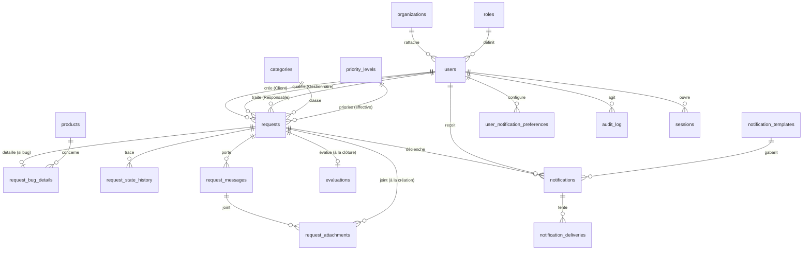

# 08 — Modèle de données

## 8.1 Vue d'ensemble

Le modèle relationnel décrit ci-dessous est conçu pour **PostgreSQL** (chapitre 11). Il vise trois objectifs :

1. **Lisibilité** — des entités identifiables sans connaissance préalable du domaine.
2. **Auditabilité** — chaque entité opérationnelle porte des horodatages de création/modification, et toute modification métier sensible est tracée dans `audit_log`.
3. **Évolutivité** — anticipation des fonctionnalités V2 (SMS/WhatsApp, intégrations externes) sans migration lourde.

### 8.1.1 Conventions générales

- **[EXG-08-001] (MUST)** Identifiants primaires : `UUID v4` ou `ULID`. Pas d'identifiants auto-incrémentés exposés vers l'extérieur (l'ID humain de la demande `MTF-…` est un champ séparé, voir §8.3).
- **[EXG-08-002] (MUST)** Tous les horodatages sont stockés en **UTC** (`timestamp with time zone`). L'affichage utilisateur applique le fuseau de l'utilisateur (par défaut Africa/Abidjan).
- **[EXG-08-003] (MUST)** Convention de nommage : tables au pluriel et en `snake_case` (`requests`, `request_messages`), colonnes en `snake_case`. Clés étrangères suffixées `_id`.
- **[EXG-08-004] (MUST)** Toute entité opérationnelle porte `created_at`, `updated_at` (mise à jour automatique via trigger), et `deleted_at` (soft-delete optionnel, voir §8.7).
- **[EXG-08-005] (MUST)** Les énumérations sont stockées soit comme `enum` PostgreSQL natif, soit comme `varchar` contraint par `CHECK`. Le choix est laissé à la phase de conception, en faveur de la portabilité (`varchar + CHECK`).

## 8.2 Inventaire des entités

| # | Entité | Rôle |
|---|---|---|
| 1 | `organizations` | Organisations clientes de TECHDIFRIK. |
| 2 | `users` | Comptes utilisateurs tous rôles confondus. |
| 3 | `roles` | Référentiel fixe des cinq rôles. |
| 4 | `categories` | Catalogue des catégories de demandes. |
| 5 | `products` | Catalogue des produits/services TECHDIFRIK référencés dans les bugs. |
| 6 | `requests` | Demandes (cœur du domaine). |
| 7 | `request_bug_details` | Champs spécifiques aux demandes de catégorie « Bug ». |
| 8 | `request_state_history` | Journal des transitions d'état d'une demande. |
| 9 | `request_messages` | Messages échangés sur une demande (Client/Gestionnaire/Responsable). |
| 10 | `request_attachments` | Pièces jointes attachées à une demande ou à un message. |
| 11 | `evaluations` | Notes et commentaires de satisfaction à la clôture. |
| 12 | `priority_levels` | Référentiel des cinq priorités P0-P4 et de leurs SLA paramétrables. |
| 13 | `categories_to_default_owner_teams` (opt.) | Mapping catégorie → équipe Responsable indicative. |
| 14 | `notification_templates` | Modèles de courriels et autres canaux. |
| 15 | `notifications` | Notifications émises (in-app + métadonnées d'envoi). |
| 16 | `notification_deliveries` | Tentatives d'envoi par canal. |
| 17 | `user_notification_preferences` | Préférences de notification par utilisateur. |
| 18 | `audit_log` | Journal d'audit immuable. |
| 19 | `password_reset_tokens` | Jetons de réinitialisation de mot de passe. |
| 20 | `account_activation_tokens` | Jetons d'activation de compte. |
| 21 | `sessions` | Sessions actives (refresh tokens, métadonnées de connexion). |
| 22 | `knowledge_base_entries` | Fiches de bugs marquées réutilisables (vue ou table dédiée). |
| 23 | `business_hours_settings` | Référentiel des heures ouvrées et jours fériés. |
| 24 | `system_settings` | Clés-valeurs de configuration paramétrable par l'Administrateur. |

## 8.3 Schéma logique simplifié

## 8.4 Description détaillée des entités principales

> Format des colonnes : `nom : type [contraintes] — description`.

### 8.4.1 `organizations`

- `id : uuid PK`
- `name : varchar(200) NOT NULL UNIQUE`
- `external_reference : varchar(80)` — code client interne TECHDIFRIK (ERP, comptabilité).
- `address_line, city, country : varchar` — coordonnées postales.
- `primary_contact_email : varchar(254)` — courriel de référence (peut différer des comptes individuels).
- `is_active : boolean NOT NULL DEFAULT true`
- `created_at, updated_at, deleted_at`

### 8.4.2 `roles`

Table de référence à 5 lignes, non modifiable via l'interface.

- `id : varchar(20) PK` — valeurs : `CLIENT`, `GESTIONNAIRE`, `RESPONSABLE`, `ADMIN`, `DG`.
- `label : varchar(80) NOT NULL`
- `description : text`

### 8.4.3 `users`

- `id : uuid PK`
- `email : varchar(254) NOT NULL UNIQUE` (index unique, insensible à la casse).
- `email_status : varchar` (`VALID`, `INVALID`) — utilisé par §7.4.4.
- `password_hash : varchar(255)` — bcrypt ou argon2id (voir chapitre 10).
- `first_name, last_name : varchar(120) NOT NULL`
- `phone : varchar(40)` — format E.164 recommandé.
- `avatar_url : varchar(500)`
- `role_id : varchar(20) FK roles(id) NOT NULL`
- `organization_id : uuid FK organizations(id)` — nullable pour les rôles internes ; obligatoire pour `CLIENT`.
- `is_active : boolean NOT NULL DEFAULT true`
- `locked_until : timestamptz NULL` — verrouillage temporaire après échecs auth.
- `failed_login_count : smallint NOT NULL DEFAULT 0`
- `last_login_at, last_password_changed_at : timestamptz`
- `notification_preferences : jsonb` — préférences agrégées (ou table dédiée `user_notification_preferences`).
- `time_zone : varchar(64)` — par défaut `Africa/Abidjan`.
- `created_at, updated_at, deleted_at`

Contraintes :

- **[EXG-08-010] (MUST)** `CHECK (role_id <> 'CLIENT' OR organization_id IS NOT NULL)`.
- **[EXG-08-011] (MUST)** Index unique fonctionnel `LOWER(email)` pour insensibilité à la casse.

### 8.4.4 `categories`

- `id : uuid PK`
- `code : varchar(40) UNIQUE NOT NULL` — slug stable (ex. `BUG`, `PANNE`, `INFO`, `EVOLUTION`).
- `label : varchar(120) NOT NULL`
- `description : text`
- `default_priority_id : varchar(5) FK priority_levels(id)` — par défaut `P3`.
- `requires_bug_details : boolean NOT NULL DEFAULT false` — si `true`, force la collecte des champs de §6.2.1.
- `is_active : boolean NOT NULL DEFAULT true`
- `is_reserved : boolean NOT NULL DEFAULT false` — voir §3.5 [EXG-03-033].
- `default_responsible_team : varchar(80)` — indicatif.
- `created_at, updated_at`

### 8.4.5 `priority_levels`

Table de référence à 5 lignes.

- `id : varchar(5) PK` — valeurs : `P0`, `P1`, `P2`, `P3`, `P4`.
- `label : varchar(40) NOT NULL` (« Bloquant », etc.)
- `description : text`
- `sla_first_response_minutes : integer NOT NULL` — paramétrable.
- `sla_resolution_minutes : integer NOT NULL` — paramétrable.
- `is_24x7 : boolean NOT NULL DEFAULT false` — seul P0 est `true` au MVP.

### 8.4.6 `requests`

L'entité centrale. Cardinalité estimée : croissance ~1000-5000 lignes/an au démarrage [À CONFIRMER].

- `id : uuid PK`
- `public_reference : varchar(20) UNIQUE NOT NULL` — `MTF-AAAAMMJJ-NNNN`, généré à la soumission.
- `created_by_user_id : uuid FK users(id) NOT NULL` — auteur Client.
- `organization_id : uuid FK organizations(id) NOT NULL`
- `category_id : uuid FK categories(id) NOT NULL`
- `title : varchar(200) NOT NULL` — résumé court saisi par le Client.
- `description : text NOT NULL`
- `impact : varchar(20) NOT NULL` — enum `BLOCAGE_TOTAL` / `BLOCAGE_PARTIEL` / `DEGRADATION` / `AUCUN_IMPACT`.
- `urgency : varchar(20) NOT NULL` — enum `CRITIQUE` / `ELEVEE` / `MODEREE` / `FAIBLE`.
- `client_context_note : varchar(500)`
- `system_priority_id : varchar(5) FK priority_levels(id) NOT NULL`
- `effective_priority_id : varchar(5) FK priority_levels(id) NOT NULL` — initialisée à `system_priority_id`.
- `priority_override_reason : text` — obligatoire si différente.
- `status : varchar(40) NOT NULL` — voir chapitre 04 (`NOUVELLE`, …).
- `previous_status_before_wait : varchar(40)` — utilisé pour la reprise depuis `EN_ATTENTE_CLIENT`.
- `assigned_to_user_id : uuid FK users(id)` — Responsable nominal.
- `assigned_by_user_id : uuid FK users(id)` — Gestionnaire ayant affecté.
- `qualified_by_user_id : uuid FK users(id)`
- `reopen_count : smallint NOT NULL DEFAULT 0` — max 2, voir [EXG-04-031].
- `cancellation_reason, rejection_reason : text` — selon T04/T05.
- **Horodatages métier** : `created_at, qualified_at, first_response_at, resolved_at, closed_at, last_reopened_at`.
- `waiting_client_total_ms : bigint NOT NULL DEFAULT 0` — cumul.
- `sla_due_first_response_at, sla_due_resolution_at : timestamptz`
- `is_sla_first_response_respected, is_sla_resolution_respected : boolean` — calculés à la clôture.
- `updated_at, deleted_at`

Index recommandés :

- `(status, effective_priority_id, created_at)` pour les files d'attente.
- `(organization_id, created_at)` pour les vues Client par organisation.
- `(assigned_to_user_id, status)` pour la file personnelle du Responsable.
- Index trigramme sur `title` et `description` pour la recherche full-text (extension `pg_trgm` ou `tsvector`).

### 8.4.7 `request_bug_details`

Table 1-1 optionnelle avec `requests` quand `categories.requires_bug_details = true`.

- `request_id : uuid PK FK requests(id) ON DELETE CASCADE`
- `product_id : uuid FK products(id) NOT NULL`
- `product_version : varchar(60) NOT NULL`
- `expected_behavior, observed_behavior, reproduction_steps : text NOT NULL`
- `occurred_at : timestamptz NOT NULL`
- `is_recurrent : boolean NOT NULL`
- `frequency_label : varchar(40)`
- `environment_os, environment_browser : varchar(120)`
- `environment_hardware : varchar(300)`
- `is_blocking : boolean NOT NULL`
- `error_messages : text`
- `is_reproduced : varchar(20)` — `OUI` / `NON` / `PARTIEL` / `NON_TESTE`.
- `root_cause, corrective_action, workaround : text`
- `fix_deployed, workaround_only : boolean`
- `is_knowledge_base_eligible : boolean NOT NULL DEFAULT false`
- `external_tracker_ref : varchar(300)` — V2.
- `updated_at`

### 8.4.8 `products`

- `id : uuid PK`
- `code : varchar(40) UNIQUE NOT NULL`
- `label : varchar(160) NOT NULL`
- `description : text`
- `default_owner_team : varchar(80)`
- `requires_os, requires_browser : boolean` — voir [EXG-06-010].
- `is_active : boolean NOT NULL DEFAULT true`
- `created_at, updated_at`

### 8.4.9 `request_state_history`

Append-only.

- `id : uuid PK`
- `request_id : uuid FK requests(id) ON DELETE CASCADE`
- `from_status, to_status : varchar(40)` — `from_status` est `null` à la création.
- `transition_code : varchar(10)` — `T01`…`T19`.
- `actor_user_id : uuid FK users(id)` — `null` pour les transitions système (T17).
- `motive : text` — obligatoire selon la transition.
- `metadata : jsonb` — payload spécifique (priorité avant/après, par exemple).
- `occurred_at : timestamptz NOT NULL DEFAULT now()`

### 8.4.10 `request_messages`

- `id : uuid PK`
- `request_id : uuid FK requests(id) ON DELETE CASCADE`
- `author_user_id : uuid FK users(id) NOT NULL`
- `body : text NOT NULL` — Markdown limité (voir [EXG-03-055]).
- `is_internal : boolean NOT NULL DEFAULT false` — message Gestionnaire/Responsable non visible du Client.
- `is_withdrawn : boolean NOT NULL DEFAULT false`
- `withdrawn_at : timestamptz`
- `withdrawal_reason : varchar(300)`
- `created_at`

Index : `(request_id, created_at)`.

### 8.4.11 `request_attachments`

- `id : uuid PK`
- `request_id : uuid FK requests(id) ON DELETE CASCADE`
- `message_id : uuid FK request_messages(id) ON DELETE CASCADE NULL` — si attaché à un message spécifique.
- `uploaded_by_user_id : uuid FK users(id) NOT NULL`
- `original_filename : varchar(255) NOT NULL`
- `mime_type : varchar(120) NOT NULL`
- `size_bytes : bigint NOT NULL`
- `storage_bucket : varchar(120) NOT NULL`
- `storage_key : varchar(500) NOT NULL` — clé S3.
- `storage_etag : varchar(120)`
- `antivirus_status : varchar(20) NOT NULL` — `PENDING` / `CLEAN` / `INFECTED` / `ERROR`.
- `antivirus_checked_at : timestamptz`
- `is_withdrawn : boolean NOT NULL DEFAULT false`
- `withdrawal_reason : varchar(300)`
- `created_at`

### 8.4.12 `evaluations`

- `request_id : uuid PK FK requests(id) ON DELETE CASCADE`
- `score : smallint NOT NULL CHECK (score BETWEEN 1 AND 5)`
- `comment : text`
- `submitted_by_user_id : uuid FK users(id) NOT NULL`
- `submitted_at : timestamptz NOT NULL DEFAULT now()`

### 8.4.13 `notification_templates`

- `id : uuid PK`
- `code : varchar(80) UNIQUE NOT NULL` — `ACCUSE_RECEPTION`, etc.
- `channel : varchar(20) NOT NULL` — `EMAIL`, `IN_APP`, etc.
- `subject_template, body_html_template, body_text_template : text` — Mustache/Liquid limité.
- `is_active : boolean NOT NULL DEFAULT true`
- `version : smallint NOT NULL DEFAULT 1`
- `created_at, updated_at`

### 8.4.14 `notifications`

- `id : uuid PK`
- `event_code : varchar(80) NOT NULL` — `DEMANDE_AFFECTEE`, etc.
- `request_id : uuid FK requests(id) NULL` — null pour les notifications hors demande (sécurité).
- `recipient_user_id : uuid FK users(id) NOT NULL`
- `template_id : uuid FK notification_templates(id)`
- `payload : jsonb NOT NULL` — variables fusionnées.
- `is_critical : boolean NOT NULL DEFAULT false` — non désactivable.
- `is_read_in_app : boolean NOT NULL DEFAULT false`
- `read_at : timestamptz`
- `created_at`

### 8.4.15 `notification_deliveries`

- `id : uuid PK`
- `notification_id : uuid FK notifications(id) ON DELETE CASCADE`
- `channel : varchar(20) NOT NULL`
- `status : varchar(20) NOT NULL` — `PENDING`, `SENT`, `FAILED`, `BOUNCED`.
- `attempts : smallint NOT NULL DEFAULT 0`
- `last_attempt_at : timestamptz`
- `error_message : text`
- `provider_message_id : varchar(255)`

### 8.4.16 `audit_log`

Append-only. Cible : volume principal de la base à long terme.

- `id : bigint generated always as identity PK`
- `occurred_at : timestamptz NOT NULL DEFAULT now()`
- `actor_user_id : uuid FK users(id) NULL`
- `actor_role : varchar(20)`
- `action_code : varchar(80) NOT NULL` — `REQUEST_CREATED`, `PRIORITY_OVERRIDDEN`, `USER_DISABLED`, etc.
- `object_type : varchar(40) NOT NULL`
- `object_id : varchar(80)`
- `payload : jsonb` — avant/après si applicable.
- `client_ip : inet`
- `user_agent : varchar(500)`
- `request_id_correlation : varchar(80)` — identifiant de requête HTTP pour corrélation.

Partitionnement recommandé par mois (`occurred_at`) pour soutenir la rétention sur 5 ans.

### 8.4.17 Autres entités

- `password_reset_tokens, account_activation_tokens` : `user_id, token_hash, expires_at, used_at`. Le jeton est stocké **hashé** (SHA-256) ; le secret n'est jamais en base en clair.
- `sessions` : `id, user_id, refresh_token_hash, ip, user_agent, created_at, last_used_at, expires_at, revoked_at`.
- `business_hours_settings` : jour de semaine, plage horaire, jours fériés associés (table simple).
- `system_settings` : `key (PK), value (jsonb), updated_by_user_id, updated_at`. Stocke les durées paramétrables (verrouillage, session, validation clôture, etc.).

## 8.5 Calcul de la priorité système

> **[EXG-08-020] (MUST)** Le calcul est encapsulé dans une fonction côté serveur (et **non** dans la base de données) testable indépendamment. La base stocke uniquement les entrées (`impact`, `urgency`, `category_id`) et la sortie (`system_priority_id`).

## 8.6 Indexation et performances

- **[EXG-08-030] (MUST)** Indexer `requests.public_reference` (lookup direct par le Client).
- **[EXG-08-031] (MUST)** Indexer `requests(status, effective_priority_id)` pour les files d'attente.
- **[EXG-08-032] (MUST)** Indexer `requests(assigned_to_user_id, status)`.
- **[EXG-08-033] (MUST)** Indexer `notifications(recipient_user_id, is_read_in_app, created_at DESC)` pour le badge in-app.
- **[EXG-08-034] (SHOULD)** Mettre en place un index full-text (`tsvector` ou `pg_trgm`) sur `requests.title`, `requests.description`, `request_messages.body` pour la recherche.
- **[EXG-08-035] (SHOULD)** Partitionner `audit_log` et `request_state_history` par mois ou trimestre dès qu'ils dépassent ~10M lignes.

## 8.7 Soft-delete

- **[EXG-08-040] (MUST)** Les entités opérationnelles (`users`, `organizations`, `categories`, `products`, `requests`) supportent un soft-delete via `deleted_at`. Une ligne soft-deleted n'apparaît plus dans les requêtes par défaut mais reste disponible aux audits.
- **[EXG-08-041] (MUST)** Les entités append-only (`audit_log`, `request_state_history`, `notifications`, `notification_deliveries`, `request_messages` retirés mais conservés) **n'ont jamais** de suppression, ni hard ni soft.
- **[EXG-08-042] (MUST)** La suppression définitive d'un compte utilisateur dans le cadre du droit à l'effacement RGPD (chapitre 10) est traitée par anonymisation : remplacement des champs nominatifs par une valeur générique, conservation de l'`id` et des liens, traçabilité dans le journal d'audit.

## 8.8 Stratégie de migration et versionning

- **[EXG-08-050] (MUST)** Toutes les évolutions de schéma passent par des migrations versionnées, exécutées par l'outil idiomatique de la stack retenue (Prisma Migrate, Liquibase, Flyway, Alembic, Doctrine Migrations, etc. — à arbitrer avec la stack).
- **[EXG-08-051] (MUST)** Les migrations destructrices (suppression de colonne, suppression de table) suivent une procédure en deux temps (déploiement applicatif sans usage → migration destructive) pour permettre les rollbacks.
- **[EXG-08-052] (SHOULD)** Les seeds initiaux (les 5 lignes de `roles`, les 5 lignes de `priority_levels`, le catalogue initial de catégories) sont gérés en migrations idempotentes.
